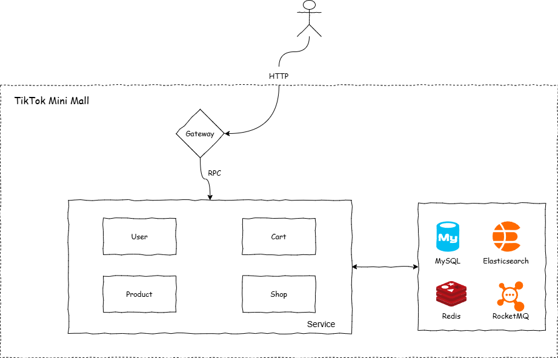

<div align="center">

# TikTok Mini Mall

_🌸 字节青训营（2025），简易版抖音商城 🌸_

</div>

TikTok Mini Mall 是 2025 字节青训营中的后端大项目，题目要求为做一个简易版的抖音商城。

技术栈：Gin、gRPC、GORM、Go-Redis、RocketMQ

## 项目架构



## 目录结构

```
/tiktok-mini-mall
├── /api                # 接口定义
│   ├── /pb             # 存放生成的 gRPC 相关代码
│   ├── product.proto   
│   ├── cart.proto     
│   ├── shop.proto     
│   └── user.proto      
├── /cmd                # 服务启动入口
│   ├── /cart           
│   │   └── cart_main.go     
│   ├── /gateway        
│   │   └── gateway_main.go    
│   ├── /product        
│   │   └── prod_main.go    
│   ├── /shop          
│   │   └── shop_main.go    
│   └── /user           
│       └── user_main.go     
├── /configs            # 存放配置文件
│   └── ... (配置文件)
├── /docs               
├── /internal           # 各个服务的具体实现
│   ├── /app            
│   │   ├── /cart       
│   │   ├── /gateway    
│   │   ├── /product    
│   │   ├── /shop       
│   │   └── /user       
├── /pkg                # 公共库文件
│   └── ... (公共模块)
├── /test               # 测试代码
│   └── ... (测试文件)
├── README.md           
└── go.mod
```

